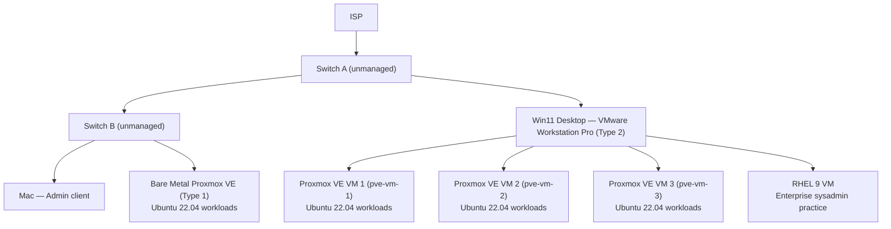

# homelab-infra

> Infrastructure documentation and engineering journal for my SRE/DevOps transition.
> Built from scratch. Broken on purpose. Fixed with intent.

[](https://www.proxmox.com/)
[](https://www.vmware.com/)
[](https://ubuntu.com/)
[](https://www.redhat.com/)
[](https://aws.amazon.com/certification/)
[](https://learn.microsoft.com/en-us/certifications/azure-fundamentals/)

[](https://www.linkedin.com/in/andrew-jones-8779b6247/)
[](https://youtube.com/@DrewonDigital)
[](https://twitch.tv/DrewOnDigital)
[](https://tiktok.com/@drewondigital)

---

## About

**Andrew Jones** · Dallas–Fort Worth, TX

10+ years in IT Support Engineering and Help Desk → actively transitioning to **Junior SRE / DevOps Engineer**.
Target role date: **September 30, 2026**. Long-game target: CISO / CTO / CIO.

This repo is the infrastructure spine of that transition — a living system that documents architecture decisions,
project completions, engineering runbooks, and lessons learned along the way.

This is not a tutorial repo. This is a real lab, running real services, learning real lessons.

---

## Architecture

### Physical topology



### Virtualization stack

| Layer | Technology | Role |
|---|---|---|
| Physical host | Win11 + VMware Workstation Pro | Type 2 hypervisor — nested lab platform |
| Nested hypervisor | Proxmox VE × 3 (pve-vm-1/2/3) | Primary SRE/DevOps workload platform |
| Primary guest OS | Ubuntu 22.04 LTS | All SRE/DevOps project workloads |
| Alternate guest | RHEL 9 | Enterprise sysadmin and cert practice |
| Bare metal node | Proxmox VE (Type 1, Switch B) | High-performance workloads, K8s target node |

> **Interview note:** The VMware → Proxmox → Ubuntu nested chain demonstrates working knowledge of
> both Type 1 and Type 2 hypervisors, hardware-assisted virtualization (Intel VT-x / AMD-V),
> and real-world lab constraints — uncommon depth at the junior SRE level.

See [`architecture/`](./architecture/) for detailed diagrams and design decision records.

---

## Project roadmap

10 sequential projects building one cohesive platform. Each project lives in its own repo.
This repo is the hub that links them all.

| # | Project | Core Skills | Repo | Status |
|---|---|---|---|---|
| 01 | Containerization baseline | Docker, Compose, image management | [homelab-01-containers](#) | 🔄 In progress |
| 02 | Internal DNS + static IPs | CoreDNS, IP schema, host resolution | [homelab-02-dns](#) | ⬜ Planned |
| 03 | Reverse proxy + TLS | NGINX, Certbot, cert management | [homelab-03-proxy](#) | ⬜ Planned |
| 04 | Observability stack | Prometheus, Grafana, Loki, alerting | [homelab-04-observability](#) | ⬜ Planned |
| 05 | Identity and access | Authelia, LDAP, SSO | [homelab-05-iam](#) | ⬜ Planned |
| 06 | Infrastructure as Code | Terraform, Ansible, idempotency | [homelab-06-iac](#) | ⬜ Planned |
| 07 | CI/CD pipeline | GitHub Actions, self-hosted runners | [homelab-07-cicd](#) | ⬜ Planned |
| 08 | Kubernetes | k3s / kubeadm, 3-node cluster | [homelab-08-k8s](#) | ⬜ Planned |
| 09 | GitOps | ArgoCD, Flux, declarative state | [homelab-09-gitops](#) | ⬜ Planned |
| 10 | Platform engineering | Internal developer platform, self-service | [homelab-10-platform](#) | ⬜ Planned |

> Repo links activate as projects are completed and published.

---

## Certifications

| Certification | Status | Date |
|---|---|---|
| AZ-900 — Azure Fundamentals | ✅ Passed | December 2024 |
| AWS CLF-C02 — Cloud Practitioner | ✅ Passed | March 2026 |
| CompTIA Network+ | 🔄 In progress | — |
| CompTIA Security+ | 📋 Queued | — |
| AWS SAA-C03 — Solutions Architect Associate | 📋 Queued | — |
| AWS SAP-C02 — Solutions Architect Professional | 📋 Queued | — |
| AWS AI Specialty | 📋 Queued | — |

---

## Repository structure

```
homelab-infra/
├── README.md                  ← You are here — hub and index
├── architecture/              ← Topology diagrams, design decision records
├── environments/              ← Per-node specs, VM inventory, hardware details
├── networking/                ← IP schema, VLAN design, firewall rules
├── automation/                ← Scripts, Ansible playbooks, utilities
└── progress/
    └── JOURNAL.md             ← Running engineering journal and learning log
```

---

## Related repositories

| Repo | Description | Status |
|---|---|---|
| [homelab-infra](https://github.com/DrewOnDigital/homelab-infra) | This repo — infra hub, architecture, journal | Active |
| *(project repos added as completed)* | | |

---

## Engineering journal

Running notes on decisions made, things broken, things learned, and skills acquired
are tracked in [`progress/JOURNAL.md`](./progress/JOURNAL.md).

---

## Tech stack

`Proxmox VE` `VMware Workstation` `Ubuntu 22.04 LTS` `RHEL 9`
`Docker` `NGINX` `Prometheus` `Grafana` `Loki`
`Terraform` `Ansible` `GitHub Actions`
`AWS` `Azure` `CoreDNS` `Authelia`

---

*Last updated: April 2026 · DFW, TX*
