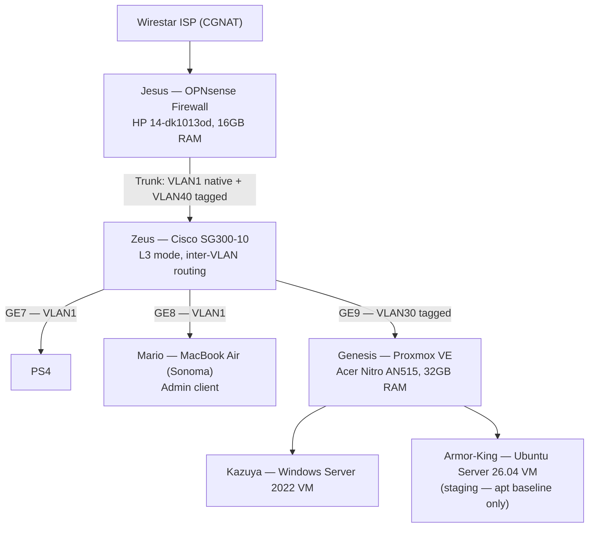

# homelab-infra

> Infrastructure documentation and engineering journal for my SRE/DevOps transition.
>  
> Built from scratch.
>  
> Broken on purpose.
>  
> Fixed with intent.

[](https://www.proxmox.com/) [](https://opnsense.org/) [](https://ubuntu.com/) [](https://www.microsoft.com/windows-server) [](https://aws.amazon.com/certification/) [](https://learn.microsoft.com/en-us/certifications/azure-fundamentals/)

[](https://www.linkedin.com/in/andrew-jones-8779b6247/) [](https://youtube.com/@DrewonDigital) [](https://twitch.tv/DrewOnDigital) [](https://tiktok.com/@drewondigital)

---

## About

**Andrew Jones** · Dallas–Fort Worth, TX

Over a decade in IT Support Engineering  → actively transitioning to **Junior SRE / DevOps Engineer**.

This repo is the infrastructure spine of that transition — a living system that documents architecture decisions,
incidents survived, and lessons learned along the way.

This is not a tutorial repo. This is a real lab, running real services, breaking in real ways, and getting fixed
with real root-cause diagnosis — not "restart it and hope."

---

## Current state (as of August 2026)

A firewalled, VLAN-segmented home network running on real (not nested/virtualized) hardware, with a bare-metal
hypervisor hosting server workloads.

### Physical & logical topology


```mermaid
graph TD
    ISP["Wirestar ISP (CGNAT)"] --> JESUS["Jesus — OPNsense Firewall\nHP 14-dk1013od, 16GB RAM"]
    JESUS -->|"Trunk: VLAN1 native + VLAN40 tagged"| ZEUS["Zeus — Cisco SG300-10\nL3 mode, inter-VLAN routing"]
    ZEUS -->|"GE7 — VLAN1"| PS4["PS4"]
    ZEUS -->|"GE8 — VLAN1"| MARIO["Mario — MacBook Air (Sonoma)\nAdmin client"]
    ZEUS -->|"GE9 — VLAN30 tagged"| GENESIS["Genesis — Proxmox VE\nAcer Nitro AN515, 32GB RAM"]
    GENESIS --> KAZUYA["Kazuya — Windows Server 2022 VM"]
    GENESIS --> ARMORKING["Armor-King — Ubuntu Server 26.04 VM\n(staging — apt baseline only)"]
```

### VLAN schema

| VLAN | Name | Subnet | Gateway (Zeus SVI) | Notes |
| --- | --- | --- | --- | --- |
| 1 | Default / Native | 192.168.1.0/24 | 192.168.1.4 | Untagged on every Zeus port — Mario + PS4 live here |
| 20 | Desktops | 10.20.20.0/24 | 10.20.20.1 | Routed via Zeus, static route on Jesus |
| 30 | Servers | 10.30.30.0/24 | 10.30.30.1 | Kazuya + Armor-King — tagged only on Genesis's port (GE9) |
| 40 | IoT | 10.40.40.0/24 | 10.40.40.1 | Owned directly by Jesus (OPT1, tag 40) |

Routing model: Jesus's single USB-C adapter (`ue0`) trunks native VLAN1 + tagged VLAN40 to Zeus. Zeus runs in
L3 mode and handles inter-VLAN routing for 20/30; Jesus holds static routes pointing at Zeus's gateway
(`zeus_gw` — 192.168.1.4) for those subnets, and owns WAN/NAT + IoT directly.

> **Known constraint:** Wirestar issues a CGNAT (carrier-grade NAT) address on the WAN interface — confirmed via
> a private RFC 1918 address (`10.128.x.x/22`) handed out over DHCP instead of a public IP. No inbound
> port-forwarding is possible without a VPN/tunnel workaround. Documented as a deliberate constraint, not an
> oversight.

### Hardware

| Node | Role | Hardware | Notes |
| --- | --- | --- | --- |
| Jesus | OPNsense Firewall | HP 14-dk1013od, 16GB RAM | Single USB-C (RTL8153) adapter handles LAN trunk |
| Zeus | L3 Managed Switch | Cisco SG300-10 | Inter-VLAN routing, 10-port |
| Genesis | Hypervisor | Acer Nitro AN515, 32GB RAM | Proxmox VE, bare metal |
| Mario | Admin client | MacBook Air, macOS Sonoma | VLAN1 |
| Kazuya | Server VM | — | Windows Server 2022, VLAN30, on Genesis |
| Armor-King | Server VM | — | Ubuntu Server 26.04, VLAN30, on Genesis (staging) |

---

## Recent wins

Real incidents, real diagnosis, real fixes — each one documented in full in [`incidents/`](incidents/).

- **[RTL8153 USB adapter silent TX failure](incidents/)** — Diagnosed a FreeBSD 14.3 `ure` driver race condition
  causing Jesus's LAN adapter to report healthy link state while silently dropping outbound frames. Fixed by
  hardcoding speed/duplex, bypassing the auto-negotiation race entirely.
- **[Outbound NAT alias/mode gap](incidents/)** — Diagnosed a subnet losing internet access while all
  internal routing stayed healthy — twice. Second time, recognized the pattern and resolved it in minutes.
- **[Full VLAN segmentation build](incidents/)** — Designed and deployed a 4-VLAN network with Zeus handling
  L3 inter-VLAN routing and Jesus handling WAN/NAT/IoT — replacing a flat, unsegmented network.
- **[Hostname-rename DNS outage](incidents/)** — Diagnosed a full LAN DNS timeout triggered by an OPNsense
  hostname change, isolating the failure to the resolver service rather than the firewall itself.
- **[VLAN cleanup discipline](incidents/)** — Proactively removed two half-configured VLANs before they could
  cause another undocumented outage, rather than leaving them as landmines.

---

## Certifications

| Certification | Status | Date |
| --- | --- | --- |
| AZ-900 — Azure Fundamentals | ✅ Passed | December 2024 |
| AWS CLF-C02 — Cloud Practitioner | ✅ Passed | March 2026 |
| CompTIA Network+ | 🔄 In progress | — |
| CompTIA Security+ | 🔄 In progress| — |
| AWS SAA-C03 — Solutions Architect Associate | 📋 Queued | — |

---

## What's next

- Finish Network+ certification
- Backfill `progress/JOURNAL.md` to close the documentation gap between April and August 2026
- Write up each Recent Win as a full case study in `incidents/`
- Bring Armor-King (Ubuntu 26.04) online as an active workload, past baseline `apt` staging
- Possible future: reintroduce a dedicated management VLAN (retired in August 2026 after causing an
  undocumented outage) once it can be built and documented properly the first time

---

## Repository structure

```
homelab-infra/
├── README.md              ← You are here — current state + hub
├── incidents/             ← Standalone case studies of individual incidents
├── architecture/           ← Topology diagrams, design decision records
├── environments/           ← Per-node specs, VM inventory, hardware details
├── networking/             ← IP schema, VLAN design, firewall rules
├── automation/             ← Scripts, Ansible playbooks, utilities
└── progress/
    └── JOURNAL.md          ← Running engineering journal and learning log
```

---

## Engineering journal

Running notes on decisions made, things broken, things learned, and skills acquired are tracked in
[`progress/JOURNAL.md`](progress/JOURNAL.md).

---

## Skills log

| Skill | Context | Confidence |
| --- | --- | --- |
| OPNsense firewall administration | Jesus — NAT, routing, interface config | Comfortable |
| VLAN design & segmentation | 4-VLAN network across Zeus + Jesus | Comfortable |
| Cisco SG300 L3 switching | Zeus — inter-VLAN routing, port/VLAN mgmt | Developing |
| Network incident diagnosis | NAT gap, DNS outage, driver race condition | Comfortable |
| FreeBSD driver-level troubleshooting | `ure` driver race condition on Jesus | Developing |
| Proxmox VE — bare metal hypervisor | Genesis | Comfortable |
| Git — branching, staging, committing | Daily practice | Developing |
| Windows Server 2022 | Daily practice | Developing |
| AWS — cloud fundamentals | CLF-C02 passed | Comfortable |
| Azure — cloud fundamentals | AZ-900 passed | Comfortable |

---

## Tech stack

`OPNsense` `FreeBSD` `Linux` `Proxmox VE` `Cisco SG300` `Ubuntu Server` `Windows Server` `VLAN/802.1Q` `AWS` `Azure`

---

*Last updated: August 2026 · DFW, TX*
